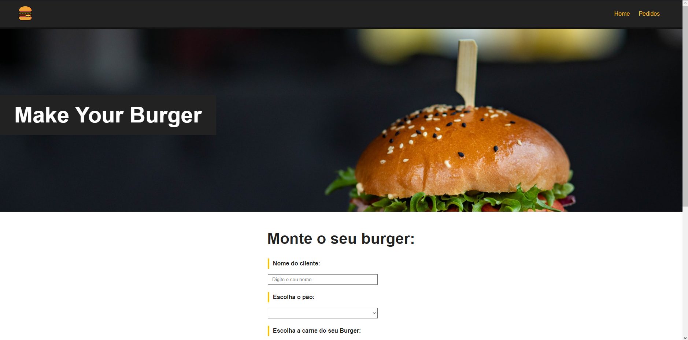

# MAKE YOUR BURGER

### Projeto criado para o aprendizado de Vue.js

O projeto consiste em um sistema onde a pessoa poderá criar um hamburguer a partir de opções pré-definidas, depois terá a opções de ver todos os hamburgueres criados, podendo realizar ações com ele como mudar status e cancelar o pedido.

O projeto foi criado usando as seguintes tecnologias de front-end:
 - Vue.js

O back-end foi simulado usando o pacote "json-server".

## Screenshots

